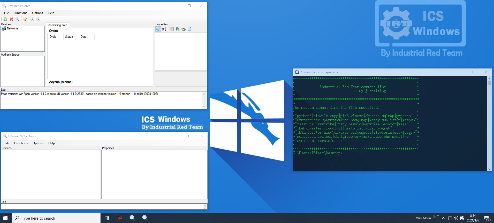

# ICS Windows v2.0
距离上一次IRTeam发布ICS windows v1.0已经差不多一年了，根据很多安全小伙伴的要求，此次更新版本基于原来kali windows v1.1，更新了Windows 10 1909版本，同时增加了一些工具并加入一些ICS attack工具。这是一款为网络安全从业人员打造的免费安全研究平台。

首先，从百度网盘下载ICS.ova（文件链接：https://pan.baidu.com/s/1znkAD4i3v0qyw3zytAYPQA 提取码：6diu ）
可以导入vmware，vbox和kvm，配置需求，2 vCPU，8G内存，60G硬盘，网卡桥接。

开机后会进入登陆界面：

输入用户名和密码（密码询问剑思庭），进入界面后可以看到相应的版本信息。

在底部菜单栏里有一项<Win-Menu>可以看到这个平台所带有工具分类和列表。

可以看到我们常用的brup，msf，nmap等我们常用的安全工具。

这里要介绍一下ICS基于工控安全的一些研究工具，比如hsl这款能够和众多工控设备通讯测试的工具，它主要是完成控制设备io的和内存地址的读写。

同时，还提供了modbus tcp的服务器模拟器和客户端，S7协议的服务器的模拟器和客户端，同时还提供了基于Profinet和ethernet/ip的协议在线分析和诊断工具，以及基于opc da的访问客户端。同时ICS windows v2.0还封装了一个ICS command line，把一些常用的工具和命令提前集成进去，直接使用tab键就可以快速输入，推荐网络安全小伙伴从这个命令行进入使用安全工具。

ICS Windows v2.0工具平台提供以下工具集：

DOS Attacks

    abdal-loris
    hping
    apachedos
    memcrashed
    perlflood
    slowloris
    slowloris6

Exploitation Tools

    ExploitPack_12
    msfconsole
    nc
    nc64
    Netsparker Pro
    Nmap – Zenmap GUI
    nosqlmap
    PowerSploit
    shodansploit
    sqlmap
    wepwnise
    winexs
    xsstrike
    XAttacker
    Acunetix Pro

Forensic

    Acunetix Pro
    adb
    Autoruns
    Autoruns64
    awatch
    BluetoothView
    BrowsingHistoryView
    Cain
    CFF Explorer
    ChromeCacheView
    cloudfail
    cports
    CredentialsFileView
    DataProtectionDecryptor
    Diskmon
    DNSDataView
    DNSQuerySniffer
    DownloadMgrPasswordDump
    DownTester
    DriverList_x64
    DriverList_x86
    Elcomsoft eXplorer for WhatsApp
    Elcomsoft Internet Password Breaker
    Ettercap-0.7.4
    FastResolver
    FullEventLogView
    HTTP Debugger Pro
    HTTPNetworkSniffer
    httprecon
    hydra
    ILSpy
    Immunity Debugger
    iOS Forensic Toolkit
    LiveContactsView
    logonsessions
    logonsessions64
    MegaDumper
    mimikatz
    MozillaHistoryView
    MyLastSearch
    mzcv
    ncat
    ndiff
    NetConnectChoose
    NetResView
    NetRouteView
    Netsparker
    NetworkLatencyView
    NetworkTrafficView
    nmap
    nping
    ntfsinfo
    ntfsinfo64
    PE Detective
    PingInfoView
    portmon
    Process Hacker 2
    procexp
    procexp64
    Procmon
    PsExec
    PsExec64
    psfile
    psfile64
    PsGetsid
    PsGetsid64
    PsInfo
    PsInfo64
    pskill
    pskill64
    pslist
    pslist64
    PsLoggedon
    PsLoggedon64
    psloglist
    psloglist64
    pspasswd
    pspasswd64
    psping
    psping64
    PsService
    PsService64
    psshutdown
    pssuspend
    pssuspend64
    QuickSetDNS
    RAMMap
    Registrar Registry Manager (64-bit)
    ResourceHacker
    Restorator 2018
    smsniff
    Sysmon
    Sysmon64
    TcpLogView
    Tcpvcon
    Tcpview
    USBDeview
    VaultPasswordView
    Volumeid
    Volumeid64
    webscreenshot
    whoistd
    WifiChannelMonitor
    WifiInfoView
    WinDump
    Winobj
    WirelessNetView
    Wireshark
    WNetWatcher
    Network Scanner
    IDA Pro
    habu

Hardware Hacking

    adb
    apktool
    Arduino
    Elcomsoft eXplorer for WhatsApp
    iOS Forensic Toolkit
    UEFIFind
    USBDeview
    Andriller

ICS Attacks

    EIPExporer
    HslCommunication
    ModScan32
    ModSim32
    nmap-scada
    password
    profinetExplorer
    S7 client
    S7 Server
    OPC Client

Information Gathering

    Cain
    cloudfail
    crawler
    DNSDataView
    DNSQuerySniffer
    DownTester
    Ettercap-0.7.4
    FastResolver
    FOCA
    HTTP Debugger Pro
    HTTPNetworkSniffer
    httprecon
    InSpy
    inSSIDer 4
    IP List Generator 2 (x64)
    IP Subnet Calculator
    ipnetinfo
    mimikatz
    nc
    nc64
    NetConnectChoose
    NetResView
    NetRouteView
    netscan
    Netsparker
    NetworkLatencyView
    NetworkTrafficView
    Nmap – Zenmap GUI
    nmap
    PingInfoView
    portmon
    RouterScan
    shodansploit
    SmartWhois
    smsniff
    snmptest
    sublist3r
    TcpLogView
    theharvester
    ubntdiscovery
    whoistd
    WifiChannelMonitor
    WifiInfoView
    winexs
    WirelessNetView
    WNetWatcher
    wpgrab
    th3inspector
    hashid
 
Malware Analysis Tools
 
    adb
    Andriller
    AndroChef Java Decompiler 1.0
    APK Easy Tool
    apk-editor-studio
    apk-icon-editor
    apktool
    Arduino
    Burp Suite Community Edition
    CFF Explorer
    Cheat Engine
    cstool
    de4dot-x64
    de4dot
    dnSpy
    DriverList_x64
    DriverList_x86
    Elcomsoft eXplorer for WhatsApp
    HTTP Debugger Pro
    HTTPNetworkSniffer
    httprecon
    hzmd5cracker
    ILSpy
    Immunity Debugger
    iOS Forensic Toolkit
    MegaDumper
    Nmap – Zenmap GUI
    ollydbg
    PE Detective
    ProcessActivityView32
    ProcessActivityView64
    RAMMap
    Registrar Registry Manager (64-bit)
    ResourceHacker
    Restorator 2018
    TcpLogView
    Tcpvcon
    Tcpview
    UEFIFind
    USBDeview
    VaultPasswordView
    Wi-Fi Scanner
    WifiChannelMonitor
    WirelessNetView
    Wireshark
    IDA Pro

Mobile Tools

    adb
    AndroChef Java Decompiler 1.0
    APK Easy Tool
    apk-editor-studio
    apk-icon-editor
    apktool
    Odin3
    Andriller

Multimedia

    AIMP
    PotPlayer 64 bit

Network & Internet

    aria2c
    awatch
    BluetoothView
    Cain
    Cisco AnyConnect Secure Mobility Client
    cports
    DNSDataView
    DNSQuerySniffer
    DownTester
    Ettercap-0.7.4
    FastResolver
    HTTPNetworkSniffer
    hydra
    IP List Generator 2 (x64)
    IP Subnet Calculator
    ipnetinfo
    logonsessions
    logonsessions64
    Mozilla Thunderbird
    msfconsole
    nc
    nc64
    ncat
    ncrack
    ndiff
    NetConnectChoose
    NetResView
    NetRouteView
    netscan
    NetworkLatencyView
    NetworkTrafficView
    Nmap – Zenmap GUI
    nmap
    nping
    OpenConnect-GUI VPN client
    PingInfoView
    plink
    portmon
    Proxifier
    Proxy Checker
    pscp
    psftp
    putty
    puttygen
    puttytel
    QuickSetDNS
    RouterScan
    shodansploit
    SmartWhois
    smsniff
    snmptest
    sublist3r
    TcpLogView
    Tcpvcon
    Tcpview
    ubntdiscovery
    whoistd
    WifiChannelMonitor
    WifiInfoView
    WirelessNetView
    Wireshark
    WNetWatcher
    Firefox
    Google Chrome
    MantraPortable
    Tor Browser
    Colasoft Packet Builder 2.0
    Telegram
    NBMonitor
    Network Scanner

Password Attacks

    Advanced Archive Password Recovery
    Advanced Office Password Recovery
    Advanced PDF Password Recovery
    aircrack-ng
    bruteforcer
    BulletsPassView
    Cain
    ChromePass
    crunch
    Dialupass
    DownloadMgrPasswordDump
    Elcomsoft Internet Password Breaker
    hashcat32
    hashcat64
    hydra
    iepv
    john
    mailpv
    mkbrutus
    msfconsole
    mspass
    ncrack
    netpass
    Nmap – Zenmap GUI
    OperaPassView
    PasswordFox
    pspv
    PstPassword
    rcrack
    rcrack_cl
    rcrack_cl_gui
    rcrack_cuda
    rcrack_cuda_gui
    rcrack_gui
    rdpv
    RouterPassView
    rt2rtc
    rtc2rt
    rtgen
    rtmerge
    rtsort
    Sentry_MBA
    SniffPass
    VNCPassView
    WebBrowserPassView
    WirelessKeyView
    Wireshark
    wpbrutexmlrpc
    xattacker
    xsspwn
    xbruteforcer
    hzmd5cracker
    Acunetix Pro
    patator

Programming tools

    Advanced BAT to EXE Converter PRO v2.83
    AndroChef Java Decompiler 1.0
    APK Easy Tool
    apk-editor-studio
    apk-icon-editor
    Byte_Adder
    Git Bash
    HeidiSQL
    mysql
    mysqldump
    pgAdmin 4
    php
    ProcessActivityView32
    ProcessActivityView64
    SNSRemover
    SQL Shell (psql)
    premake

Rat & SpyWare

    Black Stealer
    Costex FTP Keylogger
    Costex SMTP Keylogger
    DarkComet
    DarkCometRAT Remover
    Nano File Binder
    Spoofer-Binder
    UST

Remote Control

    AnyDesk
    pageant
    plink
    pscp
    psftp
    putty
    puttygen
    puttytel
    winbox
    Xftp
    Xlpd
    Xmanager
    Xshell
    nc64
    nc
    VNC Viewer

Reporting Tools

    Kainet LogViewPro
    ndiff
    Netsparker
    serpico

Reverse Engineering

    AndroChef Java Decompiler 1.0
    APK Easy Tool
    apk-editor-studio
    apk-icon-editor
    Burp Suite Community Edition
    CFF Explorer
    Cheat Engine
    cstool
    de4dot-x64
    de4dot
    dnSpy
    DriverList_x64
    DriverList_x86
    ILSpy
    Immunity Debugger
    MegaDumper
    Nmap – Zenmap GUI
    ollydbg
    PE Detective
    ProcessActivityView32
    ProcessActivityView64
    Registrar Registry Manager (64-bit)
    ResourceHacker
    Restorator 2018
    adb
    apktools
    hzmd5cracker
    IDA Pro
    yara
    yarac
    HxD
    cutter
    wxHexEditor
    binwalk

Security

    Abdal Anti GiliSoft USB Lock 5x-4x-3x
    Abdal Anti GiliSoft USB Lock 7.x
    Autoruns
    Autoruns64
    Diskmon
    KeePass 2
    logonsessions
    logonsessions64
    procexp
    procexp64
    Procmon
    RunPEDetector
    sdelete
    sdelete64
    VeraCrypt
    WinAuth
    XArp
    NBMonitor
    Flash Memory Protector

Sniffing & Spoofing

    Burp Suite Community Edition
    Change MAC Address
    Byte_Adder
    Cain
    Colasoft Packet Builder 2.0
    HTTP Debugger Pro
    nc
    nc64
    NetworkLatencyView
    NetworkTrafficView
    Nmap – Zenmap GUI
    nmap
    smsniff
    snmptest
    TcpLogView
    Tcpvcon
    Tcpview
    whoistd
    WifiChannelMonitor
    WifiInfoView
    WirelessNetView
    Wireshark
    WNetWatcher
    YouTube View Increaser v3
    habu

Utility

    7-Zip File Manager
    Acrobat Reader DC
    Advanced BAT to EXE Converter PRO v2.83
    AIMP
    Autologon
    Cisco AnyConnect Secure Mobility Client
    Desktops
    FileZilla Server Interface
    FileZilla
    Hard Disk Sentinel
    hostseditor
    Internet Download Manager
    IP List Generator 2 (x64)
    IP Subnet Calculator
    Mozilla Thunderbird
    OpenConnect-GUI VPN client
    pgAdmin 4
    plink
    PotPlayer 64 bit
    Proxifier
    Proxy Checker
    pscp
    psftp
    puttygen
    puttytel
    Rainmeter
    SQL Shell (psql)
    UltraISO
    Telegram
    PowerISO
    Your Unin-staller!
    rufus
    Flash Memory Protector
    aria2c

Virus Coding

    Abdal Autoit Cryptor
    Abdal Autoit IDE
    Abdal Autoit Info
    Abdal Autoit Info_x64
    Byte_Adder
    JetBrains CLion 2019.1.3
    JetBrains GoLand 2019.1 x64
    JetBrains GoLand 2019.1
    Nano File Binder
    Spoofer-Binder
    UST

Web Applications

    Burp Suite Community Edition
    cloudfail
    crawler
    ExploitMyUnion
    FOCA
    HTTP Debugger Pro
    hydra
    msfconsole
    ncrack
    Netsparker Pro
    nikto
    nosqlmap
    OWASP ZAP 2.7.0
    Sentry_MBA
    sqlmap
    sublist3r
    Vega
    webscreenshot
    Wireshark
    wpscan
    pwpscan
    xattacker
    xbruteforcer
    xsspwn
    xsspy
    xsssniper
    xsstrike
    Acunetix Pro

Web Browser

    Firefox
    Google Chrome
    Mantra
    Tor Browser

Wireless Attacks

    airbase-ng
    aircrack-ng
    airdecap-ng
    airdecloak-ng
    aireplay-ng
    airodump-ng
    airolib-ng
    airserv-ng
    airtun-ng
    airventriloquist-ng
    besside-ng
    buddy-ng
    CommView for WiFi
    easside-ng
    Ekahau HeatMapper
    inSSIDer 4
    ivstools
    kstats
    makeivs-ng
    Network Stumbler
    packetforge-ng
    tkiptun-ng
    wesside-ng
    wpaclean

Programing Support

    Python3
    python2
    c++
    c
    VC++
    GO
    Perl
    Java
    PHP
    Ruby
    Scala
    PostgreSQL
    MYSQL
